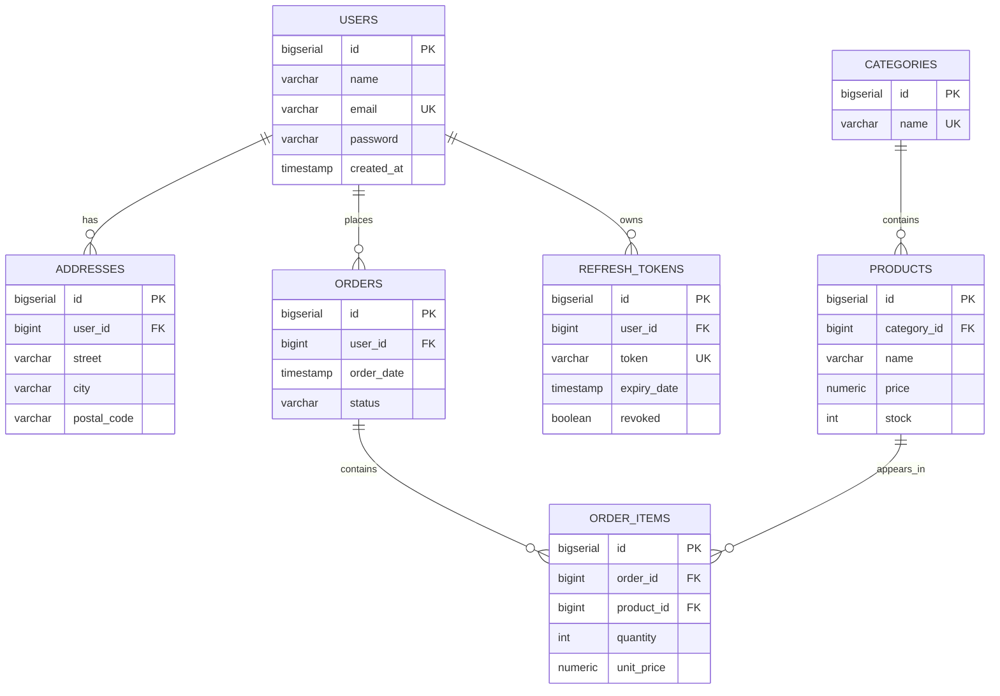

```mermaid
erDiagram
  USERS ||--o{ ADDRESSES : has
  USERS ||--o{ ORDERS : places
  USERS ||--o{ REFRESH_TOKENS : owns
  CATEGORIES ||--o{ PRODUCTS : contains
  ORDERS ||--o{ ORDER_ITEMS : contains
  PRODUCTS ||--o{ ORDER_ITEMS : appears_in

  USERS {
    bigserial id PK
    varchar name
    varchar email UK
    varchar password
    timestamp created_at
  }
  ADDRESSES {
    bigserial id PK
    bigint user_id FK
    varchar street
    varchar city
    varchar postal_code
  }
  REFRESH_TOKENS {
    bigserial id PK
    bigint user_id FK
    varchar token UK
    timestamp expiry_date
    boolean revoked
  }
  CATEGORIES {
    bigserial id PK
    varchar name UK
  }
  PRODUCTS {
    bigserial id PK
    bigint category_id FK
    varchar name
    numeric price
    int stock
  }
  ORDERS {
    bigserial id PK
    bigint user_id FK
    timestamp order_date
    varchar status
  }
  ORDER_ITEMS {
    bigserial id PK
    bigint order_id FK
    bigint product_id FK
    int quantity
    numeric unit_price
  }
```
